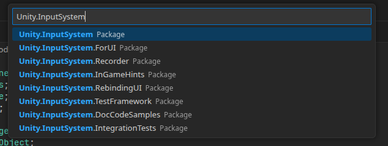
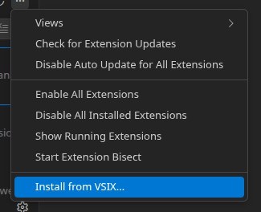

# unity-asmdef

This is an extension for helping with assembly definitions for the Unity game engine.

> Warning: This extension is still in early alpha!

## Features

- Assembly references: Adds a command palette action for adding a reference to the current file's assembly. (Ctrl + Shift + P -> asmdef: Reference Assembly)

> Tip: If an assembly reference doesn't show up, try updating assemblies (Ctrl + Shift + P -> asmdef: Update Assemblies)

## Installation

- Download the .vsix file from https://github.com/cookie1170/unity-asmdef/releases/latest

- Go to extensions and select "Install from VSIX"

- Select the downloaded extension